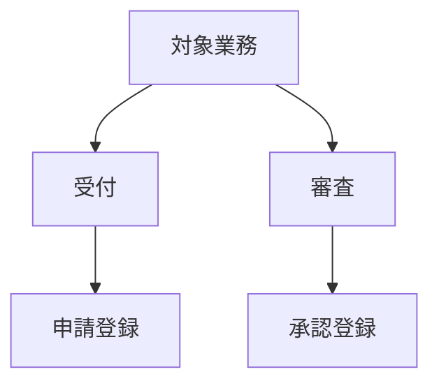

# 業務機能マップ

## 1. 文書の目的
業務の責務と配下機能の対応関係を整理し、機能分割の妥当性と抜け漏れを確認する。

## 2. 業務機能マップ
<!-- AI_CONTEXT_START --><!--
- 業務を起点に、機能カテゴリや主要機能群への分解を Mermaid 図で記載する。
--><!-- AI_CONTEXT_END -->
<!-- AI_FORMAT_START --><!--

--><!-- AI_FORMAT_END -->
<!-- AI_EDITABLE_START -->
```mermaid
graph TD
```
<!-- AI_EDITABLE_END -->

## 3. 対応表
<!-- AI_CONTEXT_START --><!--
- 業務責務ごとに、機能カテゴリと代表機能を紐付けて記載する。
--><!-- AI_CONTEXT_END -->
<!-- AI_FORMAT_START --><!--
| 業務責務 | 機能カテゴリ | 代表機能 | 備考 |
| --- | --- | --- | --- |
| 受付 | 入力 | 申請登録 | 添付登録を含む |
| 判定 | 審査 | 承認登録 | 条件分岐あり |
--><!-- AI_FORMAT_END -->
<!-- AI_EDITABLE_START -->
| 業務責務 | 機能カテゴリ | 代表機能 | 備考 |
| --- | --- | --- | --- |
<!-- AI_EDITABLE_END -->