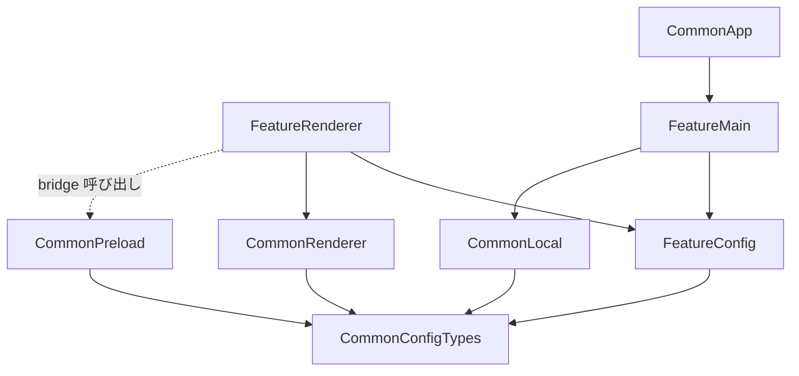

# Electron / TypeScript コーディング規約

（画面追加容易性・責務分離・IPC 安全性重視）

## 0. 基本方針（MUST）

- 本規約は **Electron + TypeScript を用いたデスクトップアプリの新規開発向け** とする
- TypeScript は **strict モード** を前提とする
- アプリケーションは **main process / preload / renderer process を明確に分離** する
- renderer process から **Node.js / Electron API / 外部 API を直接呼び出してはならない**
- 外部通信・OS 連携・ウィンドウ制御は **main process 側へ集約** する
- preload は **最小限の bridge だけを公開** し、業務ロジックを持ってはならない
- 画面追加は **規約に従うディレクトリ・ファイル構成** を前提とし、中央の登録処理をなるべく増やさない
- 画面固有処理と共通処理を分離し、共通化できるものは `common/` へ寄せる
- 文字列リテラルの重複を避け、**画面名・IPC チャネル名・環境変数名は定数化** する
- ユーザー向けメッセージは **意味が理解できる日本語** を基本とする

---

## 1. プロセス境界と責務分離

### 1.1 main process の責務（MUST）

- Electron アプリの起動・終了制御
- `BrowserWindow` の生成と切り替え
- IPC ハンドラー登録
- API / ファイル / OS 連携などの外部アクセス
- 画面遷移の統制
- 起動失敗時のダイアログ表示

```ts
// ✅ 推奨
export const registerExampleHandlers = (): void => {
  ipcMain.removeHandler(LOAD_DATA_CHANNEL_NAME);
  ipcMain.handle(LOAD_DATA_CHANNEL_NAME, async () => {
    return await fetchExampleData();
  });
};
```

### 1.2 preload の責務（MUST）

- `contextBridge.exposeInMainWorld(...)` による **最小 API 公開のみ** を担う
- renderer が必要とする共通 API を厳選して公開する
- `ipcRenderer` をそのまま露出してはならない
- Node.js オブジェクトや Electron オブジェクトをそのまま露出してはならない

```ts
// ✅ 推奨
contextBridge.exposeInMainWorld('ipcApi', {
  invoke: async <T = unknown>(channelName: string, ...args: unknown[]): Promise<T> => {
    return (await ipcRenderer.invoke(channelName, ...args)) as T;
  },
});
```

### 1.3 renderer process の責務（MUST）

- 画面描画
- ユーザー操作の受付
- 読み込み状態・エラー状態の表示
- preload 経由の API 呼び出し

```ts
// ✅ 推奨
window.addEventListener('DOMContentLoaded', () => {
  void window.ipcApi.invoke<string>(LOAD_DATA_CHANNEL_NAME);
});
```

### 1.4 禁止事項（MUST NOT）

- renderer から `electron` を直接 import してはならない
- renderer から `fetch` や `process.env` を直接使ってはならない
- preload に UI ロジックや業務ロジックを書いてはならない
- main process に画面固有の DOM 操作を書いてはならない
- `nodeIntegration: true` を前提にしてはならない
- `contextIsolation: false` を前提にしてはならない

---

## 2. 画面単位の構成ルール

### 2.1 画面ディレクトリ

- 画面は `application/<business-code>/<subsystem-name>/<ScreenName>/` に配置する
- `ScreenName` は **パスカルケース** とする
- 1 画面 = 1 ディレクトリを原則とする

```text
application/
└── <business-code>/
    └── <subsystem-name>/
        └── <ScreenName>/
```

### 2.2 必須ファイル（MUST）

各画面ディレクトリには、原則として次のファイルを配置する。

| ファイル | 役割 |
| --- | --- |
| `<ScreenName>Config.ts` | 画面名・IPC チャネル名などの定数定義 |
| `<ScreenName>Handlers.ts` | main process 側の IPC ハンドラー登録 |
| `<ScreenName>Logic.ts` | renderer 側の画面初期化・UI ロジック |
| `<ScreenName>Screen.ts` | 画面定義の公開 (`SCREEN_DEFINITION`) |
| `<ScreenName>View.html` | 画面 HTML エントリ |
| `<ScreenName>Window.ts` | `BrowserWindow` 生成処理 |

### 2.3 `Config.ts` のルール（MUST）

- 画面名、IPC チャネル名などの **共有定数のみ** を定義する
- 他ファイルから参照される識別子はここへ集約する
- マジックストリングを各所へ分散させてはならない

```ts
// ✅ 推奨
export const SCREEN_NAME = 'ExampleScreen';
export const LOAD_DATA_CHANNEL_NAME = 'aaa00001:get-example-data';
```

### 2.4 `Handlers.ts` のルール（MUST）

- IPC 登録のみを担当する
- ビジネスロジックや外部通信の詳細は `common/local/` へ委譲する
- 再登録安全性のため、`ipcMain.handle(...)` の前に `ipcMain.removeHandler(...)` を呼ぶ

### 2.5 `Logic.ts` のルール（MUST）

- renderer 側の表示ロジックのみを持つ
- `window.ipcApi` や `window.navigationApi` を利用する
- 直接 `electron` を import してはならない
- 他画面への依存は原則として **相手画面の `Config.ts` に定義された画面名定数のみ** とする

### 2.6 `Screen.ts` のルール（MUST）

- `SCREEN_DEFINITION` を export する
- `screenName`、`createWindow`、`registerHandlers` を明示する
- 既定画面を定める場合のみ `isDefault: true` を指定する
- `isDefault: true` は **1 画面のみ** とする

```ts
export const SCREEN_DEFINITION: ScreenDefinition = {
  screenName: SCREEN_NAME,
  createWindow: createExampleWindow,
  registerHandlers: registerExampleHandlers,
  isDefault: true,
};
```

### 2.7 `Window.ts` のルール（MUST）

- `BrowserWindow` の生成と HTML 読み込みだけを担当する
- preload スクリプトを明示的に指定する
- 初期表示ちらつき防止のため、`show: false` を基本とする

### 2.8 `View.html` のルール（MUST）

- renderer のマウント先となる `root` 要素を配置する
- 対応する `Logic.js` を `defer` 付きで読み込む
- 画面固有の HTML は最小限に留め、見た目や状態管理は `Logic.ts` 側へ寄せる

```html
<script src="./ExampleScreenLogic.js" defer></script>
<div id="root"></div>
```

---

## 3. 命名規則

### 3.1 ディレクトリ・ファイル

- 業務コードディレクトリ: 小文字コード
  - 例: `aa`
- サブシステムディレクトリ: **ケバブケース推奨**
  - 例: `sample-subsystem`
- 画面ディレクトリ: **パスカルケース**
  - 例: `HelloWorld`
- 画面ファイル: `<ScreenName><Role>.ts` 形式
  - 例: `HelloWorldHandlers.ts`
- 共通サービス / ユーティリティ: **キャメルケース**
  - 例: `messageService.ts`, `apiGatewayClient.ts`
- 型定義ファイル: 用途が明確な名前を付ける
  - 例: `global.d.ts`

### 3.2 型・関数・定数

- 型エイリアス / 型名: **パスカルケース**
  - 例: `ScreenDefinition`, `MessageDefinition`
- 関数: **キャメルケース**
  - 例: `registerHelloWorldHandlers`, `resolveDefaultScreenName`
- 変数: **キャメルケース**
  - 例: `mainWindow`, `defaultScreenDefinition`
- 定数: **全大文字スネークケース**
  - 例: `SCREEN_NAME`, `LOAD_MESSAGE_CHANNEL_NAME`

### 3.3 IPC チャネル名

- `<feature-code>:<action-name>` 形式を推奨する
- `action-name` は **ケバブケース** とする

```text
aaa00001:get-hello-world
aaa00002:get-goodbye-world
navigation:to-screen
```

### 3.4 環境変数名

- **全大文字スネークケース** とする
- 環境変数名は `common/config/constants.ts` に集約する

```ts
export const API_GATEWAY_BASE_URL_ENV_NAME = 'API_GATEWAY_BASE_URL';
```

---

## 4. TypeScript 記述ルール

### 4.1 基本方針（MUST）

- `strict: true` を前提とする
- `any` は原則禁止とする
- `catch` 節のエラーは `unknown` として扱う
- 戻り値型は明示する
- 非同期処理は `async / await` を基本とする

### 4.2 型定義の使い分け（SHOULD）

- 通常のデータ形状定義には **`type` を優先** する
- 宣言マージが必要な場合のみ `interface` を使う

```ts
// ✅ 推奨
export type MessageDefinition = {
  endpointPath: string;
  fallbackMessage: string;
  screenName: string;
};
```

### 4.3 グローバル拡張（MUST）

- preload で `window` に公開する API は `common/types/global.d.ts` に型定義を書く
- renderer 側で暗黙の `any` を発生させてはならない

```ts
declare global {
  interface Window {
    ipcApi: {
      invoke: <T = unknown>(channelName: string, ...args: unknown[]) => Promise<T>;
    };
  }
}
```

### 4.4 unknown エラーの変換（MUST）

- `unknown` のまま UI 表示してはならない
- 表示用の共通変換関数を用意してから扱う

```ts
const resolveErrorMessage = (error: unknown): string => {
  return error instanceof Error ? error.message : '不明なエラーが発生しました。';
};
```

---

## 5. 設定値・環境変数・定数の扱い

### 5.1 定数集約（MUST）

- 環境変数名・既定値・共通 IPC 名は `common/config/constants.ts` に集約する
- 同じ文字列を複数ファイルへ直接書いてはならない

### 5.2 `.env` の扱い（MUST）

- 環境変数を利用するプロジェクトでは、**ルートに `.env` を配置** する
- `.env` が必要な場合は、最低限のプレースホルダーを用意する
- README に環境変数一覧を記載する

```dotenv
API_GATEWAY_BASE_URL=
API_GATEWAY_TIMEOUT_MS=5000
```

### 5.3 `process.env` 参照の制限（MUST）

- `process.env` の参照は **main process 側の共通設定層 / 共通通信層に限定** する
- renderer 側から `process.env` を参照してはならない

---

## 6. 共通化ルール

### 6.1 `common/app/`

- アプリ全体の起動制御
- 画面レジストリ
- 画面切り替え制御

### 6.2 `common/preload/`

- renderer へ公開する bridge のみを配置する
- 依存は最小限に抑える
- 配布ビルドで壊れにくいよう、**自己完結した記述** を優先する

### 6.3 `common/local/`

- API Gateway / ローカル API / 外部通信処理を集約する
- screen 固有ハンドラーから再利用できるようにする
- 画面ファイルに通信詳細を書いてはならない

### 6.4 `common/renderer/`

- React / UI 部品 / 共通描画ロジックを集約する
- Electron 依存を書いてはならない

### 6.5 `common/types/`

- グローバル拡張や共通型定義をまとめる
- renderer / preload 間の契約を明文化する

---

## 7. IPC と画面遷移

### 7.1 IPC の基本ルール（MUST）

- renderer → main の要求は `window.ipcApi.invoke(...)` を使用する
- 画面遷移は `window.navigationApi.navigateToScreen(...)` を使用する
- `ipcMain.handle(...)` で受ける非同期要求は **画面単位の `Handlers.ts` へ集約** する

### 7.2 画面遷移の基本ルール（MUST）

- 画面遷移は main process 主導で行う
- renderer は遷移要求のみ送信し、`BrowserWindow` 操作を行ってはならない
- 存在しない画面への遷移要求は明示的にエラー表示する

### 7.3 自動登録の基本ルール（SHOULD）

- 画面登録は規約ベースの自動探索を優先する
- `*Screen.js` を探索するレジストリを利用し、中央コードの追記を最小化する

---

## 8. エラーハンドリング

### 8.1 基本ルール（MUST）

- 起動エラーは main process 側でダイアログ表示する
- 画面表示中の取得失敗は renderer 側で UI 表示する
- `unknown` エラーは安全なメッセージへ変換する
- エラー文言には **画面名や処理内容などの文脈** を含める

```ts
throw new Error(`${screenName} 用メッセージの取得に失敗しました。 ${errorMessage}`);
```

### 8.2 禁止事項（MUST NOT）

- トークン、秘密情報、内部 URL 全文を不用意に表示してはならない
- renderer を recover 不能な例外で簡単に停止させてはならない
- 起動失敗を握りつぶしてはならない

---

## 9. コメント・ドキュメント

### 9.1 コメント必須（MUST）

- export する関数・型・定数の直上にはコメントを書く
- **日本語推奨** とする
- 「何をするか」を簡潔に書く

```ts
// registerExampleHandlers は Example 画面用の IPC ハンドラーを登録します。
export const registerExampleHandlers = (): void => {
  // ...
};
```

### 9.2 README 更新（SHOULD）

次を追加・変更した場合は README 更新を検討すること。

- 新しい環境変数
- 新しい画面
- 新しい API エンドポイント
- 配布手順の変更
- 起動方法の変更

---

## 10. ディレクトリ構成

### 10.1 推奨ディレクトリツリー

```text
/ (ルートディレクトリ)
├── application/
│   └── <business-code>/
│       └── <subsystem-name>/
│           └── <ScreenName>/
│               ├── <ScreenName>Config.ts
│               ├── <ScreenName>Handlers.ts
│               ├── <ScreenName>Logic.ts
│               ├── <ScreenName>Screen.ts
│               ├── <ScreenName>View.html
│               └── <ScreenName>Window.ts
├── common/
│   ├── app/
│   │   ├── ApplicationMain.ts
│   │   └── ScreenRegistry.ts
│   ├── config/
│   │   └── constants.ts
│   ├── local/
│   │   ├── apiGatewayClient.ts
│   │   └── <serviceName>.ts
│   ├── preload/
│   │   └── RendererBridge.ts
│   ├── renderer/
│   │   └── <sharedRendererModule>.tsx
│   └── types/
│       └── global.d.ts
├── scripts/
├── .env
├── package.json
└── tsconfig.json
```

### 10.2 各ディレクトリの役割

#### `application/`
- 画面単位の実装を配置する
- 画面固有の IPC 登録、UI 初期化、Window 定義を持つ

#### `common/app/`
- アプリ全体の起動・終了・画面制御を持つ

#### `common/config/`
- 環境変数名、既定値、共通チャネル名などを持つ

#### `common/local/`
- API / 外部通信 / main process 側の共通処理を持つ

#### `common/preload/`
- renderer へ公開する bridge を持つ

#### `common/renderer/`
- React / UI の共通化部品を持つ

#### `common/types/`
- グローバル拡張や共通型定義を持つ

---

## 11. 依存関係ルール

### 11.1 基本ルール（MUST）

- `Logic.ts` から `Handlers.ts` や `Window.ts` を直接 import してはならない
- `Handlers.ts` から React / renderer 共通 UI を import してはならない
- `Window.ts` へ通信ロジックを書いてはならない
- `common/renderer/` から `electron` を import してはならない
- 他画面への依存は原則として `Config.ts` の定数参照のみに留める

### 11.2 依存関係マトリクス

|            | feature-config | feature-main | feature-renderer | common/app | common/local | common/preload | common/renderer | common/config/types |
|------------|:--------------:|:------------:|:----------------:|:----------:|:------------:|:--------------:|:---------------:|:-------------------:|
| feature-config | ❌️ | ❌️ | ❌️ | ❌️ | ❌️ | ❌️ | ❌️ | ⭕️ |
| feature-main | ⭕️ | ❌️ | ❌️ | ❌️ | ⭕️ | ❌️ | ❌️ | ⭕️ |
| feature-renderer | ⭕️ | ❌️ | ❌️ | ❌️ | ❌️ | ❌️ | ⭕️ | ⭕️ |
| common/app | ❌️ | ⭕️ | ❌️ | ❌️ | ❌️ | ❌️ | ❌️ | ⭕️ |
| common/local | ❌️ | ❌️ | ❌️ | ❌️ | ❌️ | ❌️ | ❌️ | ⭕️ |
| common/preload | ❌️ | ❌️ | ❌️ | ❌️ | ❌️ | ❌️ | ❌️ | ⭕️ |
| common/renderer | ❌️ | ❌️ | ❌️ | ❌️ | ❌️ | ❌️ | ❌️ | ⭕️ |
| common/config/types | ❌️ | ❌️ | ❌️ | ❌️ | ❌️ | ❌️ | ❌️ | ❌️ |

### 11.3 依存関係図



---

## 12. レビュー観点（チェックリスト）

### 12.1 基本方針（セクション0, 1）

- [ ] main / preload / renderer の責務が分離されているか
- [ ] renderer から Node.js / Electron / 外部 API を直接呼んでいないか
- [ ] preload が最小 API 公開に留まっているか
- [ ] `nodeIntegration: true` に依存していないか
- [ ] `contextIsolation: false` に依存していないか

### 12.2 画面構成（セクション2）

- [ ] 1 画面 1 ディレクトリになっているか
- [ ] 必須ファイル一式が揃っているか
- [ ] `Config.ts` に共有定数が集約されているか
- [ ] `Handlers.ts` が IPC 登録専用になっているか
- [ ] `Logic.ts` が renderer ロジック専用になっているか
- [ ] `Screen.ts` で `SCREEN_DEFINITION` を export しているか
- [ ] `isDefault: true` が複数画面に付いていないか

### 12.3 命名規則（セクション3）

- [ ] 画面ディレクトリ名がパスカルケースか
- [ ] 画面ファイル名が `<ScreenName><Role>.ts` 形式か
- [ ] 関数名・変数名がキャメルケースか
- [ ] 定数名・環境変数名が全大文字スネークケースか
- [ ] IPC チャネル名が `<feature-code>:<action-name>` 形式か

### 12.4 TypeScript（セクション4）

- [ ] `any` を使っていないか
- [ ] `unknown` エラーを安全に変換しているか
- [ ] 戻り値型が明示されているか
- [ ] preload 公開 API の型が `global.d.ts` に定義されているか

### 12.5 設定値・環境変数（セクション5）

- [ ] 環境変数名と既定値が定数化されているか
- [ ] `.env` のひな形が存在するか
- [ ] README に環境変数の説明があるか
- [ ] renderer から `process.env` を参照していないか

### 12.6 共通化（セクション6, 7）

- [ ] 外部通信が `common/local/` に集約されているか
- [ ] 共通 UI が `common/renderer/` に集約されているか
- [ ] 画面遷移が main process 主導になっているか
- [ ] 自動登録ルールを壊す命名になっていないか

### 12.7 エラーハンドリング（セクション8）

- [ ] 起動エラーをダイアログ等で明示しているか
- [ ] 取得失敗時に UI で安全に表示しているか
- [ ] 秘密情報をエラーメッセージへ含めていないか

### 12.8 コメント・ドキュメント（セクション9）

- [ ] export シンボルの直上にコメントがあるか
- [ ] コメントが簡潔で役割を説明しているか
- [ ] 必要に応じて README が更新されているか

### 12.9 依存関係（セクション11）

- [ ] `Logic.ts` が main process 側実装へ依存していないか
- [ ] `Handlers.ts` が renderer 共通 UI に依存していないか
- [ ] 他画面への依存が `Config.ts` 定数参照に留まっているか
- [ ] `common/renderer/` が Electron 依存を持っていないか

---

## 13. 補足: レビュー優先度

| 優先度 | 観点 |
|:------:|------|
| 🔴 高 | プロセス境界違反、renderer からの直接 API 呼び出し、危険な preload 公開、画面構成崩れ |
| 🟡 中 | 命名規則違反、型定義不足、コメント不足、エラー表示不備 |
| 🟢 低 | フォーマット差異、表現の揺れ、README の細かな文言 |
