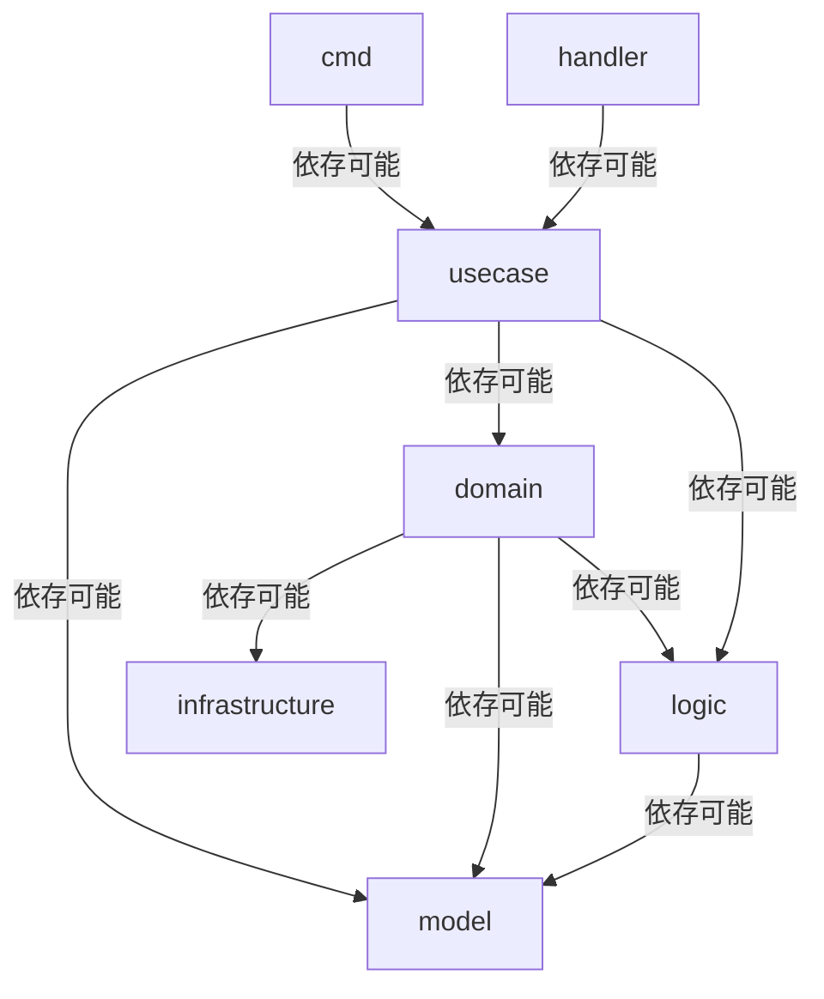

# Go コーディング規約

（関数型志向・テスト容易性重視・非 OOP）

## 0. 基本方針（MUST）

- 本規約は **新規開発向け** の Go プロジェクトを対象とする
- Go 1.24 以上を前提とする
- **オブジェクト指向は採用しない**
  - メソッド定義は禁止
  - 状態はデータとして扱い、振る舞いは関数で表現する
- **純粋関数志向** と **テスト容易性** を最優先する
- ジェネリクスは原則禁止
- init 関数の使用は原則禁止

---

## 1. メソッド禁止・OOP禁止

### 1.1 禁止事項（MUST NOT）

- 構造体にメソッドを定義してはならない

```go
// ❌ 禁止
func (u *User) Save() error { ... }
```

### 1.2 推奨スタイル

```go
// ✅ 推奨
var SaveUser = func(user User) error { ... }
```

---

## 2. テスト容易性のための関数定義

### 2.1 禁止事項（MUST NOT）
- 関数を通常の func 定義で記述してはならない
```go
// ❌ 禁止
func ValidateInput(input Input) error { ... }

// ✅ 推奨
var ValidateInput = func(input Input) error { ... }
```

### 2.1 Internal プレフィックス（MUST）

- パッケージ内部用途（非export）の関数には **`Internal_*` プレフィックス** を付与する

```go
var Internal_validateInput = func(input Input) error
```

### 2.3 通常の func 定義が許可されるケース（MAY）

- init 関数
- やむなくジェネリクスを使用する場合（原則禁止のため例外扱い）
- テストコード内の関数

---


## 3. 名前付け規則

### 3.1 パッケージ・ファイル

- **ID指定**

| aa | x | 0001 | u |
|----|---|------|---|
| 業務コード | サブシステムコード | フリー | 用途コード（usecase/domain/logic等） |

- 業務コード（小文字アルファベット2文字）
  - 例: `aa`, `jk`, `aw`
- サブシステムコード（小文字アルファベット1文字）
  - 例: `a`, `b`, `c`
- フリー（数字4桁）
  - 例: `0001`, `0002`, `0010`
- 用途コード
  - `c`: cmd
  - `h`: handler
  - `u`: usecase
  - `d`: domain
  - `l`: logic

### 3.2 Model、SQL用ファイル

- **スネークケース**

```go
user.go
order_history.go
customer_data.go
```

### 3.3 関数・型 パッケージ外部用途（Export）

- **パスカルケース**

```go
GetInstanceID()
SaveCalcudatedTotal()
```

### 3.4 関数・型 パッケージ内部用途（非Export）

- **`Internal_*` プレフィックス + キャメルケース**

```go
Internal_saveQueue()
Internal_calculateTotal()
```

### 3.5 変数

- **キャメルケース**

```go
queueSize
retryCount
```

### 3.6 定数
- **全大文字スネークケース**

```go
MAX_RETRY_COUNT
DEFAULT_TIMEOUT_SEC
```

---

## 4. 純粋関数を目指した設計

### 4.1 基本方針

- 可能な限り **純粋関数（副作用なし）** を目指す
- 以下を伴う処理は **外部依存** とみなす

  - DB / API / ファイル
  - 時刻 / ランダム値
  - 環境変数

### 4.2 外部依存の扱い（MUST）

- 外部依存は **関数の引数として受け取る**
- 結果は **戻り値として返す**

```go
var CalculateResult = func(now time.Time, input Input) (Output, error)
```

- 外部依存を避けるために、関数そのものを引数として受け取らない。

```go
// ❌ 禁止
var CalculateResult = func(nowFunc func() time.Time, input Input) (Output, error)
```

---

## 6. コメント・ドキュメント

### 6.1 コメント必須（MUST）

- すべての関数・変数の直上にコメントを書く
- **日本語推奨**
- GoDoc 形式を意識する

```go
// Internal_saveQueue はキュー情報を永続化する。
// 引数:
//   - queue: 保存対象のキュー
// 戻り値:
//   - error: 保存に失敗した場合
var Internal_saveQueue = func(queue Queue) error
```

---

## 7. インデント・フォーマット

- **gofmt / goimports の適用は必須**

---

## 8. エラーハンドリング

### 8.1 基本ルール（MUST）

- すべてのエラーは **明示的にハンドル** すること
- 以下の形式を原則とする

```go
if err != nil {
  return fmt.Errorf("〇〇の取得に失敗しました: %w", err)
}
```

- panic / recover による制御は禁止（main を除く）

### 8.2 エラーメッセージ指針

- ユーザー向けエラーは **意味が理解できる日本語**
- 内部ログ向けには `%w` により元エラーを保持
- 以下の情報は **絶対に出力してはならない**

  - 認証情報（API Key / Token / Password）
  - 個人情報
  - 内部ネットワーク構成

---

## 9. テスト

### 9.1 テスト必須範囲（MUST）

- すべての主要ロジックは **テーブル駆動テスト** で記述すること
- テストは **入力・期待値・モックの振る舞い** が一覧で把握できる構造にする

### 9.2 テーブル駆動テストの必須形式（MUST）

- テストケースは `[]struct{ ... }` で定義する
- 各ケースには **テスト名（name）を必ず含める**
- 正常系・異常系を同一テーブルで明示する

```go
func TestInternal_processQueue(t *testing.T) {

  // 元の関数を保存し、テスト終了後に復元する
  originalFetchFromAPI := Internal_fetchFromAPI
  defer func() { 
    Internal_fetchFromAPI = originalFetchFromAPI 
  }()

  // テストケース定義
  tests := []struct {
    name        string
    input       Input
    setupMock   func()
    wantResult  Result
    wantErr     bool
  }{
    // テストケース例
    {
      name:  "正常系: キュー処理が成功する",
      input: Input{ID: "1"},
      setupMock: func() {
        Internal_fetchFromAPI = func(_ context.Context, _ string) (APIResult, error) {
          return APIResult{Value: 10}, nil
        }
      },
      wantResult: Result{Total: 10},
      wantErr:    false,
    },
    {
      name:  "異常系: API がエラーを返す",
      input: Input{ID: "2"},
      setupMock: func() {
        Internal_fetchFromAPI = func(_ context.Context, _ string) (APIResult, error) {
          return APIResult{}, errors.New("api error")
        }
      },
      wantErr: true,
    },
  }

  // テスト実行ループ
  for _, tt := range tests {
    t.Run(tt.name, func(t *testing.T) {
      // モックのセットアップ
      tt.setupMock()

      // 関数呼び出し
      result, err := Internal_processQueue(context.Background(), tt.input)

      // 結果検証
      if tt.wantErr && err == nil {
        t.Fatalf("expected error, but got nil")
      }
      if !tt.wantErr && err != nil {
        t.Fatalf("unexpected error: %v", err)
      }
      if result != tt.wantResult {
        t.Errorf("result mismatch: got=%v want=%v", result, tt.wantResult)
      }
    })
  }
}
```

### 9.3 外部依存・別パッケージ関数のモック化（MUST）
**対象となる処理**  
以下は 必ずモック（置き換え）可能でなければならない。
- 外部 API 呼び出し
- DB / キャッシュ / メッセージング
- 時刻取得（time.Now 等）
- ランダム値（rand.*）
- 別パッケージに定義された関数

### 9.4 モック方法の公式ルール（MUST）
- モックは インターフェースではなく関数置換で行う
- 対象関数は パッケージレベル変数として定義された関数リテラル に限る
- テストではその変数を直接上書きする
- `testify/mock` 等のモックフレームワークの使用は **禁止**
```go
// 本番コード
var Internal_now = func() time.Time {
  return time.Now()
}
```
```go
// テストコード
Internal_now = func() time.Time {
  return time.Date(2025, 1, 1, 0, 0, 0, 0, time.UTC)
}
```

---


## 10. ディレクトリ構成

### 10.1 ディクトリツリー

```
/ (ルートディレクトリ)
├── cmd/                               # バッチにおける各ジョブのエントリーポイント
│   ├── aa/                            # 業務（AA）に関連するジョブ
│   │   ├── aax0001c.go                # ジョブ1のエントリーポイント
│   │   └── aax0002c.go                # ジョブ2のエントリーポイント
│   └── (その他ジョブフォルダー)...
├── handler/                           # 各種ハンドラー（API、Lambda）を実装するフォルダー
│   ├── aa/                            # 業務（AA）に関連するハンドラー
│   │   ├── aax0001h.go                # ハンドラー1の実装
│   │   └── aax0002h.go                # ハンドラー2の実装
│   └── (その他ハンドラーフォルダー)...
├── usecase/                           # ビジネスロジックを実装するフォルダー
│   ├── aa/                            # 業務（AA）に関連するユースケース
│   │   ├── aax0001u/                  # ユースケース1のソースコードを格納するフォルダー
│   │   │   ├── aax0001u.go            # ユースケース1の実装
│   │   │   └── aax0001u_test.go       # ユースケース1のテストコード
│   │   └── aax0002u/                  # ユースケース2のソースコードを格納するフォルダー
│   │       ├── aax0002u.go            # ユースケース2の実装
│   │       └── aax0002u_test.go       # ユースケース2のテストコード
│   ├── export/                        # （自動生成）ユースケースの公開用インターフェースを格納するフォルダー
│   │   ├── aax0001u_export.go         # （自動生成）ユースケース1の公開用インターフェース
│   │   └── aax0002u_export.go         # （自動生成）ユースケース2の公開用インターフェース
│   └── (その他ユースケースフォルダー)...
├── domain/                            # ドメインモデルを定義するフォルダー
│   ├── aa/                            # 業務（AA）に関連するドメイン
│   │   ├── aax0001d/                  # ドメイン1のソースコードを格納するフォルダー
│   │   │   ├── aax0001d.go            # ドメイン1の定義
│   │   │   └── aax0001d_test.go       # ドメイン1のテストコード
│   │   └── aax0002d/                  # ドメイン1のソースコードを格納するフォルダー
│   │       ├── aax0002d.go            # ドメイン1の定義
│   │       └── aax0002d_test.go       # ドメイン1のテストコード
│   ├── export/                        # （自動生成）ドメインの公開用インターフェースを格納するフォルダー
│   │   ├── aax0001d_export.go         # （自動生成）ドメイン1の公開用インターフェース
│   │   └── aax0002d_export.go         # （自動生成）ドメイン2の公開用インターフェース
│   └── (その他ドメインフォルダー)...
├── logic/                             # 共通ロジックやユーティリティを格納するフォルダー
│   ├── aa/                            # 業務（AA）に関連するロジック
│   │   ├── aax0001l/                  # ロジック1のソースコードを格納するフォルダー
│   │   │   ├── aax0001l.go            # ロジック1の実装
│   │   │   └── aax0001l_test.go       # ロジック1のテストコード
│   │   ├── aax0002l/                  # ロジック2のソースコードを格納するフォルダー
│   │   │   ├── aax0002l.go            # ロジック2の実装
│   │   │   └── aax0002l_test.go       # ロジック2のテストコード
│   ├── export/                        # （自動生成）ロジックの公開用インターフェースを格納するフォルダー
│   │   ├── aax0001l_export.go         # （自動生成）ロジック1の公開用インターフェース
│   │   └── aax0002l_export.go         # （自動生成）ロジック2の公開用インターフェース
│   └── (その他ロジックフォルダー)...
├── model /                            # データ転送オブジェクトなどを定義するフォルダー
│   ├── aa/                            # 業務（AA）に関連するModel
│   │   ├── Model1.go                  # Model1の定義
│   │   └── Model2.go                  # Model2の定義
│   └── (その他Modelフォルダー)...
├── /infrastructure/                       # データアクセス層を実装するフォルダー
│   ├── aws_sdk/                       # AWS SDK関連のリポジトリ
│   │   ├── s3.go                      # S3用リポジトリの汎用的な実装
│   │   ├── dynamo_db.go               # DynamoDB用リポジトリの汎用的な実装
│   │   └── (その他AWS SDKリポジトリ)...
│   ├── db/                            # データベース関連のリポジトリ
│   │   ├── oracle.go                  # Oracle用リポジトリの汎用的な実装
│   │   ├── redis.go                   # Redis用リポジトリの汎用的な実装
│   │   ├── messaging.go               # メッセージング用リポジトリの汎用的な実装
│   │   └── (その他外部アクセスリポジトリ)...
│   ├── ddl/                           # DDL関連のリポジトリ
│   │   ├── aa/
│   │   │   ├── table1.go              # テーブル1のDDL定義（CREATE/ALTER等）
│   │   │   ├── table1_test.go         # テーブル1のDDL定義のテストコード
│   │   │   ├── table2.go              # テーブル2のDDL定義（CREATE/ALTER等）
│   │   │   └── table2_test.go         # テーブル2のDDL定義のテストコード
│   │   └── (その他DDLフォルダー)...
│   ├── dml/                           # DML関連のリポジトリ
│   │   ├── aa/
│   │   │   ├── table1.go              # テーブル1のDML定義（INSERT/UPDATE/DELETE/SELECT等）
│   │   │   ├── table1_test.go         # テーブル1のDML定義のテストコード
│   │   │   ├── table2.go              # テーブル2のDML定義（INSERT/UPDATE/DELETE/SELECT等）
│   │   │   └── table2_test.go         # テーブル2のDML定義のテストコード
│   │   └── (その他DMLフォルダー)...
│   └── sql/                           # SQLクエリ関連のリポジトリ
│       ├── aa/                        # 業務（AA）に関連するSQLクエリ
│       │   ├── query1.go              # クエリ1の定義
│       │   └── query2.go              # クエリ2の定義
│       └── (その他SQLフォルダー)...
└── main.go                            # すべてのエントリーポイント
```

### 10.2 自動生成コード管理

- ユースケース・ドメイン・ロジックの公開用インターフェースは **自動生成コード** とする
- 自動生成コードは `export` サブディレクトリに格納する
- 自動生成コードは **手動編集禁止** とする。
- 自動生成するには、スキル（go-export-interface）か、その内部にあるexe（go-export-interface.exe）を使用する

```text
// AIに指示する例
スキル（go-export-interface）を使用して、goファイル（例: aax0001u.go）の公開用インターフェースを生成してください。
```

```cmd
// コマンドラインで実行する例
.\.opencode\skills\go-export-interface\scripts\go-export-interface.exe -in ./usecase/aa/aax0001u/aax0001u.go
```

### 10.3 各ディレクトリの役割

#### cmd/
- バッチジョブのエントリーポイントを格納する
- ジョブレジストリにジョブ関数を登録する

```go
package aa_cmd

import (
  "context"
  model_ac "project/model/ac"
)

// この init 関数は許可される唯一の init 関数
func init() {
  model_ac.JobRegistry["aax0001c"] = Aax0001c
}

var Aax0001c = func(ctx context.Context) error {
  // ジョブ処理内容
  return nil
}
```

#### handler/
- 各種ハンドラー（API Gateway / Lambda 等）を実装する
- ハンドラーレジストリにハンドラー関数を登録する

```go
package aa_handler

import (
  "context"
  model_ac "project/model/ac"
)

// この init 関数は許可される唯一の init 関数
func init() {
  model_ac.HandlerRegistry["aax0001h"] = Aax0001h
}

// 戻り値がある場合は、適宜変更する
var Aax0001h = func(ctx context.Context, event any) error {
  // ハンドラー処理内容
  return nil
}
```

#### usecase/
- 業務フローを実装する
- 別業務ユースケースへのアクセスは公開用インターフェース経由で行う

```go
package aax0001u

import (
  domain "project/domain/export"
)

var DataConvert = func(input Input) (Output, error) {

  var aax0001d = domain.NewAax0001d()
  data, err := aax0001d.FetchData(input.ID)
  if err != nil {
    return Output{}, fmt.Errorf("データ取得に失敗しました: %w", err)
  }
  
  var aax0002d = domain.NewAax0002d()
  convertedData, err := aax0002d.ConvertData(data)
  if err != nil {
    return Output{}, fmt.Errorf("データ変換に失敗しました: %w", err)
  }

  var aax0003l = domain.NewAax0003l()
  // ロジック処理

  // 処理内容

  return Output{}, nil
}

```

#### domain/
- 業務ルールを実装する
- 別業務ドメインへのアクセスは公開用インターフェース経由で行う
- リポジトリ（DB/SQL等）へのアクセスはここで行う

```go
package aax0001d

var FetchData = func(id string) (Data, error) {
  // ドメイン処理内容
  return Data{}, nil
}
```

#### logic/
- 業務共通ロジックやユーティリティ関数を実装する
- リポジトリ（DB/SQL等）へのアクセスは禁止

```go
package aax0001l

var CalculateDiscount = func(amount float64, rate float64) float64 {
  // ロジック処理内容
  return amount * rate
}
```

#### model/
- データ転送オブジェクト（DTO）や共通モデルを定義する

```go
package aa_model
type User struct {
  ID    string
  Name  string
  Email string
}
```

#### infrastructure/
- データアクセス層を実装する
- DB / キャッシュ / メッセージング 等の具体的なアクセス処理を実装する

```go
package aa_sql

import (
  "fmt"
  model_ac "project/model/ac"
)

var GetUserByID = func(id string) model_ac.SqlQuery {
  var sqlQuery model_ac.SqlQuery
  sqlQuery.Query = "SELECT * FROM users WHERE id = '{{id}}'"
  sqlQuery.Args = map[string]interface{}{
    "id": id,
  }
  return sqlQuery
}
```

---

## 11. パッケージ名

### 11.1 占有パッケージ名
- 各業務ごとにサブディレクトリを作成する場合は、パッケージ名を占有する

```text
対象：
/usecase/aa/aax0001u/ → package aax0001u
/domain/aa/aax0001d/  → package aax0001d
/logic/aa/aax0001l/   → package aax0001l
```

### 11.2 業務内共通パッケージ名
- 業務内で共通利用する場合は 業務名をパッケージ名とする

```text
対象：
/cmd/aa/ → package aa_cmd
/handler/aa/ → package aa_handler
/model/aa/ → package aa_model
/infrastructure/sql/aa/ → package aa_sql
/infrastructure/ddl/aa/ → package aa_ddl
/infrastructure/dml/aa/ → package aa_dml
```

### 11.3 全体共通パッケージ名
- 全体で共通利用する場合は 汎用的な名前をパッケージ名とする

```text
対象：
/usecase/export/ → package usecase
/domain/export/ → package domain
/logic/export/ → package logic
/infrastructure/db/ → package db
/infrastructure/aws_sdk/ → package aws_sdk
```

---

## 12. 別業務へのアクセス方法
### 12.1 禁止事項（MUST NOT）
- 別業務のユースケース・ドメイン・ロジックを直接importしてはならない

```go
// ❌ 禁止
import "project/usecase/bb/aabb0001"

// ただし、テストコード内であれば許可
import "project/usecase/bb/aabb0001"
```

### 12.2 推奨スタイル（MUST）
- 別業務のユースケース・ドメイン・ロジックへアクセスする場合は **公開用インターフェース経由** で行う

```go
// ✅ 推奨
import uc "project/usecase/export"

aaxx0001 := uc.NewAabb0001()
aaxx0001.Execute(...)
```

---

## 13. 依存関係ルール

※依存可能 とは import可能 を意味する

### 13.1 依存関係マトリクス

|            | cmd | handler | usecase | domain | logic | model | infrastructure |
|------------|:---:|:-------:|:-------:|:------:|:-----:|:-----:|:----------:|
| cmd        | ❌️ |   ❌️    |   ⭕️   |   ❌️   |  ❌️   |  ❌️  |    ❌️     |
| handler    | ❌️ |   ❌️    |   ⭕️   |   ❌️   |  ❌️   |  ❌️  |    ❌️     |
| usecase    | ❌️ |   ❌️    |   ❌️   |   ⭕️   |  ⭕️   |  ⭕️  |    ❌️     |
| domain     | ❌️ |   ❌️    |   ❌️   |   ❌️   |  ⭕️   |  ⭕️  |    ⭕️     |
| logic      | ❌️ |   ❌️    |   ❌️   |   ❌️   |  ❌️   |  ⭕️  |    ❌️     |
| model      | ❌️ |   ❌️    |   ❌️   |   ❌️   |  ❌️   |  ❌️  |    ❌️     |
| infrastructure | ❌️ |   ❌️    |   ❌️   |   ❌️   |  ❌️   |  ❌️  |    ❌️     |

- 違反した import は **レビューで即指摘対象**

### 13.2 依存関係図



---

## 14. レビュー観点（チェックリスト）

### 14.1 基本方針（セクション0）

- [ ] Go 1.24 以上を前提としているか
- [ ] 構造体にメソッドが定義されていないか（OOP禁止）
- [ ] ジェネリクスを使用していないか（原則禁止）

### 14.2 関数定義（セクション1, 2）

- [ ] メソッド定義（`func (r *Receiver) Method()`）が存在しないか
- [ ] 関数は `var FuncName = func(...)` 形式で定義されているか
- [ ] 非exportの関数は `Internal_*` プレフィックスが付与されているか
- [ ] 通常の `func` 定義はジェネリクス使用時またはテストコードのみか

### 14.3 名前付け規則（セクション3）

- [ ] パッケージ・ファイル名がID指定ルール（`aa` + `x` + `0001` + `u`）に従っているか
- [ ] Model・SQL用ファイルはスネークケースで命名されているか
- [ ] Export関数・型はパスカルケースか
- [ ] 非Export関数・型は `Internal_*` + キャメルケースか
- [ ] 変数はキャメルケースか
- [ ] 定数は全大文字スネークケースか

### 14.4 純粋関数設計（セクション4）

- [ ] 外部依存（DB/API/ファイル/時刻/乱数/環境変数）は引数として受け取っているか
- [ ] 関数の結果は戻り値として返しているか
- [ ] 副作用のある処理が適切に分離されているか

### 14.5 コメント・ドキュメント（セクション6）

- [ ] すべての関数・変数の直上にコメントがあるか
- [ ] コメントは日本語で記述されているか
- [ ] GoDoc形式（引数・戻り値の説明）を意識しているか

### 14.6 フォーマット（セクション7）

- [ ] gofmt / goimports が適用されているか
- [ ] 1行120文字以内か
- [ ] 長い関数シグネチャは適切に改行されているか

### 14.7 エラーハンドリング（セクション8）

- [ ] すべてのエラーが明示的にハンドルされているか
- [ ] エラーは `fmt.Errorf("〇〇に失敗しました: %w", err)` 形式でラップされているか
- [ ] panic / recover が使用されていないか（main除く）
- [ ] 認証情報・個人情報・内部ネットワーク構成がエラーメッセージに含まれていないか

### 14.8 テスト（セクション9）

- [ ] 主要ロジックにテーブル駆動テストが記述されているか
- [ ] テストケースに `name` フィールドが含まれているか
- [ ] 正常系・異常系が同一テーブルで明示されているか
- [ ] 外部依存（API/DB/時刻/乱数）がモック可能な関数変数として定義されているか
- [ ] モックは関数置換で行われているか（testify/mock等のフレームワーク禁止）
- [ ] テスト開始時に元の関数を保存し、defer で復元しているか

### 14.9 ディレクトリ・パッケージ構成（セクション10, 11）

- [ ] ファイルが適切なディレクトリに配置されているか
- [ ] パッケージ名が規約に従っているか
  - 占有パッケージ: `package aax0001u`
  - 業務内共通: `package aa_cmd` / `aa_handler` / `aa_model` / `aa_sql`
  - 全体共通: `package usecase` / `domain` / `logic` / `db`

### 14.10 別業務アクセス（セクション12）

- [ ] 別業務のユースケース・ドメイン・ロジックを直接importしていないか
- [ ] 別業務へのアクセスは公開用インターフェース（export）経由で行われているか

### 14.11 依存関係（セクション13）

- [ ] 依存関係マトリクスに違反するimportが存在しないか
  - cmd/handler → usecase のみ依存可
  - usecase → domain, logic, model のみ依存可
  - domain → logic, model, infrastructure のみ依存可
  - logic → model のみ依存可
  - model, infrastructure → 他への依存不可

---

## 補足: レビュー優先度

| 優先度 | 観点 |
|:------:|------|
| 🔴 高 | メソッド禁止、依存関係違反、エラー情報漏洩、テスト未実装 |
| 🟡 中 | 命名規則違反、コメント不足、純粋関数設計違反 |
| 🟢 低 | フォーマット、行長超過 |
